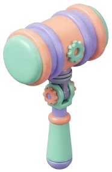

<p align="center">
  
</p>

<h1 align="center">CyberGavel Arena</h1>

<p align="center">
  <strong>$5 for consultant-grade business validation.</strong><br>
  Three AI models debate your idea. 1,000 simulations stress-test it. You get a quantified survival report.
</p>

<p align="center">
  
  
  
  
</p>

---

## What is this?

Consultants charge **$5,000+** for business due diligence. ChatGPT gives you a surface-level pep talk. CyberGavel Arena sits in between — rigorous analysis at **1/1000th** the price.

### The Process

```
Your Idea → Adversarial Debate → Monte Carlo Stress Test → Diagnostic Report
              (3 AI models)       (1,000 scenarios)         (survival score)
```

| Phase | What Happens |
|-------|-------------|
| **1. Adversarial Debate** | Three top AI models act as strategy consultant, risk analyst, and judge. 3 sessions × 5 rounds of pure, no-pleasantries cross-examination. |
| **2. Scenario Simulation** | Extracts 8-12 core assumptions and stress-tests each across boom, bust, black swan, and big-player-entry scenarios via Monte Carlo. |
| **3. Diagnostic Report** | Survival score, six-dimension radar chart, ranked fatal risks, competitive moat analysis. Data, not gut feeling. |

---

## Quick Start

```bash
# Clone
git clone https://github.com/q15432123/cybergavelarena.git
cd cybergavelarena

# Install
npm install

# Configure
cp .env.example .env
# Add your API keys to .env

# Run
npm start
# → http://localhost:3002
```

## Environment Variables

| Variable | Description |
|----------|------------|
| `ANTHROPIC_API_KEY` | Claude API key (debate engine) |
| `KIMI_API_KEY` | Kimi API key (debate engine) |
| `MINIMAX_API_KEY` | Minimax API key (debate engine) |
| `PORT` | Server port (default: `3002`) |
| `PAYMENT_ADDRESS` | Your EVM wallet address to receive $5 USDC |
| `X402_NETWORK` | `eip155:84532` (testnet) or `eip155:8453` (mainnet) |
| `FACILITATOR_URL` | x402 facilitator endpoint |

---

## Payment: x402 Protocol

Reports are gated behind a **$5 USDC** payment using the [x402 protocol](https://www.x402.org/) — an HTTP 402-based micropayment standard by Coinbase.

**How it works:**
1. User clicks "Unlock Report"
2. MetaMask connects and sends $5 USDC on Base
3. Transaction is verified via x402 facilitator
4. Full report is unlocked

> If `PAYMENT_ADDRESS` is not set in `.env`, the paywall is disabled (free dev mode).

---

## Architecture

```
┌─────────────────────────────────────────────┐
│                   Browser                    │
│  index.html → app.js → x402-pay.js          │
└──────────────────┬──────────────────────────┘
                   │ fetch
┌──────────────────▼──────────────────────────┐
│              Express Server                  │
│                                              │
│  /api/chat          → Proposal conversation  │
│  /api/chat/summarize → Structure proposal    │
│  /api/analyze       → Start analysis         │
│  /api/analyze/:id/status → Poll progress     │
│  /api/analyze/:id/report → [x402] Get report │
│  /api/report/:id/pdf     → Download PDF      │
│                                              │
│  x402 middleware ←→ Base USDC                │
└──────────────────┬──────────────────────────┘
                   │
┌──────────────────▼──────────────────────────┐
│           Engine                             │
│  debate.js      → 3-model adversarial debate │
│  stress-test.js → Monte Carlo simulation     │
│  report.js      → Score + radar + risks      │
└──────────────────┬──────────────────────────┘
                   │
┌──────────────────▼──────────────────────────┐
│           LLM Providers                      │
│  claude.js │ kimi.js │ minimax.js            │
└─────────────────────────────────────────────┘
```

---

## Tech Stack

- **Frontend:** Vanilla HTML/CSS/JS — no framework, no build step
- **Backend:** Node.js + Express
- **AI:** Three LLM providers (Claude, Kimi, Minimax)
- **Payment:** x402 protocol + USDC on Base
- **Design:** McKinsey Blue (#0066FF), Inter font, 3D clay illustrations

---

## License

MIT

---

<p align="center">
  <sub>Built with three AI models arguing with each other so you don't have to.</sub>
</p>
